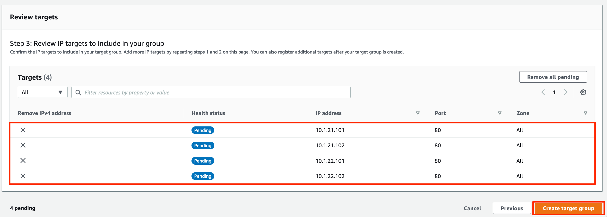

# GWLB Design 1

## 목표 구성 개요

3개의 각 워크로드 VPC \(VPC01,02,03\)은 Account내에 구성된 GWLB 기반의 보안 VPC를 통해서 내, 외부 트래픽을 처리하는 구성입니다. GWLB 기반의 보안 VPC는 2개의 AZ에 4개의 가상 Appliance가 로드밸런싱을 통해 처리 됩니다.

아래 그림은 목표 구성도 입니다.



## Cloudformation기반 VPC 배포

### 1.VPC yaml 파일 다운로드 

아래 github에서 VPC yaml 파일을 다운로드 합니다.

```text

```

### 2.AWS 관리콘솔에서 VPC 배포

AWS 관리콘솔에서 Cloudformation을 선택합니다.


앞서 다운로드 해둔 yaml 파일 중에서, 아래 그림과 같이 GWLBVPC.yml 파일을 선택합니다.


스택 세부 정보 지정에서 , 스택이름과 VPC Parameters를 지정합니다. 대부분 기본값을 사용하면 됩니다.

* 스택이름 : GWLBVPC
* AvailabilityZone A : ap-northeast-2a
* AvailabilityZone B : ap-northeast-2b
* VPCCIDRBlock: 10.254.0.0/16
* PublicSubnetABlock: 10.254.11.0/24
* PublicSubnetBBlock: 10.254.12.0/24
* InstanceTyep: t3.small
* KeyPair : 사전에 만들어 둔 keyPair를 사용합니다.


다음 단계를 계속 진행하고, 아래와 같이 "AWS CloudFormation에서 IAM 리소스를 생성할 수 있음을 승인합니다."를 선택하고, 스택을 생성합니다.


3~4분 후에 GWLBVPC가 완성됩니다.

AWS 관리콘솔 - VPC - 가상 프라이빗 클라우드 - 엔드포인트 서비스 를 선택합니다. Cloudformation을 통해서 VPC Endpoint 서비스가 이미 생성되어 있습니다. 이것을 선택하고 세부 정보를 확인합니다.

서비스 이름을 복사해 둡니다. 뒤에서 생성할 VPC들의 Cloudformation에서 사용할 것입니다.


VPC01,02,03 3개의 VPC를 Cloudformation에서 앞서 과정과 동일하게 생성합니다. 다운로드 받은 Yaml 파일들 중에 VPC01.yml, VPC02,yml, VPC03.yml을 차례로 선택해서 생성합니다.


스택 이름을 생성하고, GWLBVPC의 VPC Endpoint 서비스 이름을 "VPCEndpointServiceName" 에 입력합니다. 또한 나머지 파라미터들도 입력합니다. 대부분 기본값을 사용합니다.

* 스택이름 : VPC01, VPC02, VPC03
* AvailabilityZone A : ap-northeast-2a
* AvailabilityZone B : ap-northeast-2b
* VPCCIDRBlock: 10.1.0.0/16 \(VPC01\), 10.2.0.0/16 \(VPC02\), 10.3.0.0/16 \(VPC03\)
* PublicSubnetABlock: 10.1.11.0/24 \(VPC01\), 10.2.11.0/24 \(VPC02\), 10.3.11.0/24 \(VPC03\)
* PublicSubnetBBlock: 10.1.12.0/24 \(VPC01\), 10.2.12.0/24 \(VPC02\), 10.3.12.0/24 \(VPC03\)
* VPCEndpointServiceName : 앞서 복사해둔 GWLBVPC의 VPC endpoint service name을 입력합니다.
* PrivateToGWLB : 0.0.0.0/0 \(Private Subnet이 외부로 가는 목적지에 대한 라우팅 경로 설정입니다.\)
* InstanceTyep: t3.small
* KeyPair : 사전에 만들어 둔 keyPair를 사용합니다. 


아래와 같이 VPC가 모두 정상적으로 설정되었는지 확인해 봅니다.

AWS 관리콘솔 - VPC


## GWLB 구성 확인

GWLBVPC 구성을 확인해 봅니다.

1. GWLB 구성
2. GWLB Target Group 구성
3. VPC Endpoint 와 Service 확인
4. Appliance 확


### 3.GWLB 구성 

AWS 관리 콘솔 - EC2 - 로드밸런싱 - 로드밸런서 메뉴를 선택합니다. Gateway LoadBalancer 구성을 확인할 수 있습니다. ELB 유형이 "gateway"로 구성된 것을 확인 할 수 있습니다.


### 4.GWLB Target Group 구성 

AWS 관리 콘솔 - EC2 - 로드밸런싱 - 대상 그룹을 선택합니다. GWLB가 로드밸런싱을 하게 되는 대상그룹\(Target Group\)을 확인 할 수 있습니다.

*  프로토콜 : GENEVE 6081 \(포트 6081의 GENGEVE 프로토콜을 사용하여 모든 IP 패킷을 수신하고 리스너 규칙에 지정된 대상 그룹에 트래픽을 전달합니다.\)
* 등록된 대상 : GWLB가 로드밸런싱을 하고 있는 Target 장비를 확인합니다.


AWS 관리 콘솔 - EC2 - 로드밸런싱 - 대상 그룹 - 상태검사 메뉴를 확인합니다.

ELB와 동일하게 대상그룹\(Target Group\)에 상태를 검사할 수 있습니다. 이 랩에서는 HTTP  Path / 를 통해서 Health Check를 하도록 구성했습니다.


### 5. VPC Endpoint Service 확인

Workload VPC\(VPC01,02,03\)들과 Private link로 연결하기 위해, GWLB VPC에 Endpoint Service를 구성하였습니다. 이를 확인해 봅니다.

AWS 관리 콘솔 - VPC - 엔드포인트 서비스를 선택합니다. 생성된 VPC Endpoint Service를 확인할 수 있습니다.

* 서비스 이름 - 예 com.amazonaws.vpce.ap-northeast-2.vpce-svc-03f01aa9fbb85beb4
* 유형 : GatewayLoadBalancer
* 가용영역 : ap-northeast-2a, ap-northeast-2b

2개 영역에 걸쳐서 GWLB에 대해 VPC Endpoint Service를 구성하고 있습니다.


AWS 관리 콘솔 - VPC - 엔드포인트 서비스-엔드포인트 연결를 선택합니다.

Workload VPC \(VPC01,02,03\)의 각 가용영역들과 연결된 것을 확인 할 수 있습니다. 각 VPC별 2개의 가용영역을 구성하였기 때문에 VPC별 2개의 Endpoint가 연결됩니다.


## Workload VPC 구성 확인


